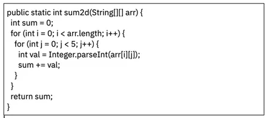

<h3>ДОМАШНЯЯ РАБОТА К СЕМИНАРУ 1:</h3>
1. Реализуйте 3 метода, чтобы в каждом из них получить разные исключения

2. Посмотрите на код, и подумайте сколько разных типов исключений вы тут сможете получить?

3. Реализуйте метод, принимающий в качестве аргументов два целочисленных массива, и возвращающий новый массив, каждый
элемент которого равен разности элементов двух входящих массивов в той же ячейке. Если длины массивов не равны,
необходимо как-то оповестить пользователя.

4. (Со звездочкой)Реализуйте метод, принимающий в качестве аргументов два целочисленных массива, и возвращающий новый массив, каждый
элемент которого равен частному элементов двух входящих массивов в той же ячейке. Если длины массивов не равны,
необходимо как-то оповестить пользователя. Важно: При выполнении метода единственное исключение, которое пользователь
может увидеть - RuntimeException, т.е. ваше.

